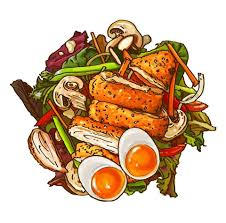

<html lang="th">
<head>
  <meta charset="UTF-8">
  <meta name="viewport" content="width=device-width, initial-scale=1.0">
  <title>ร้านข้าวไก่ทอด</title>

  
</head>

<body>

  <!-- HEADER -->
  <header>
    <h1>new</h1>
    <nav>
      <a href="#">หน้าแรก</a>
      <a href="#">เมนู</a>
      <a href="#">ติดต่อ</a>
    </nav>
  </header>

  <!-- HERO -->
  <section class="hero">
    <h2>new!</h2>
    
อิ่ม เร็ว อร่อย ในราคาที่กินได้ทุกวัน

    <a href="#" class="btn">สั่งเลย</a>
  </section>

  <!-- MENU -->
  <section class="menu">
    <h2>เมนูแนะนำ</h2>
    

      

        
        <h3>menu1</h3>
        
เผ็ดหวาน เข้มข้น

      

      

        
        <h3>menu2</h3>
        
กลมกล่อม หอมละมุน

      

      

        
        <h3>menu3</h3>
        
เข้มข้น หอมเครื่องเทศ

      

    

  </section>

  <!-- FOOTER -->
  <footer>
    © 2xxx ร้านxxxx | โทร: 08x-xxx-xxxx
  </footer>

</body>
</html>
